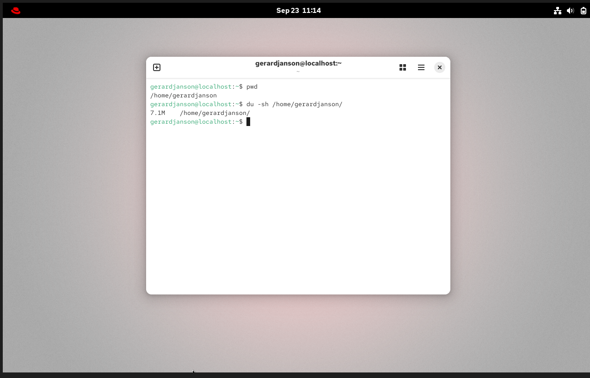
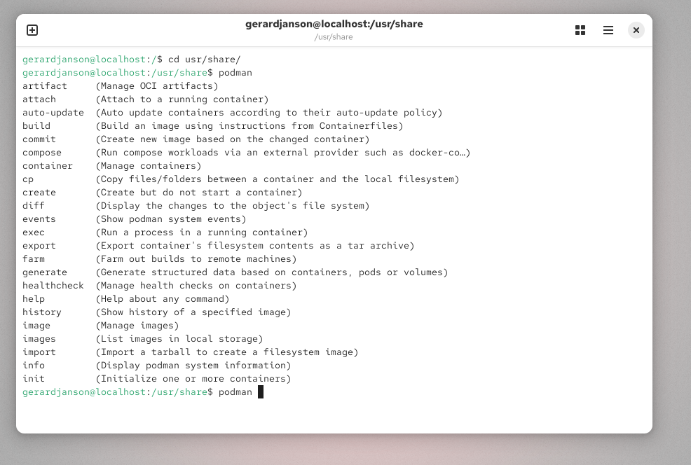

# 02. Introduction to the shell

_Video length: 3 min | Status: done_

## Goal

Practice basic command structure (command + options + arguments) and tab completion for paths and subcommands.

## Concepts involved

- Shell — interprets the commands you type (default: bash)
- Command structure — `command` + `options` (how) + `arguments` (what)
- Tab completion — auto-completes commands, paths, and some subcommands

## Commands

```bash
$ du -sh /home/gerardjanson/
7.1M /home/gerardjanson/
```



```bash
$ cd /u[TAB]sr/sha[TAB]re
```

```bash
$ podman [TAB][TAB]
$ podman g[TAB]
```



## Notes

I will incoropate tab completion more when typing in commands