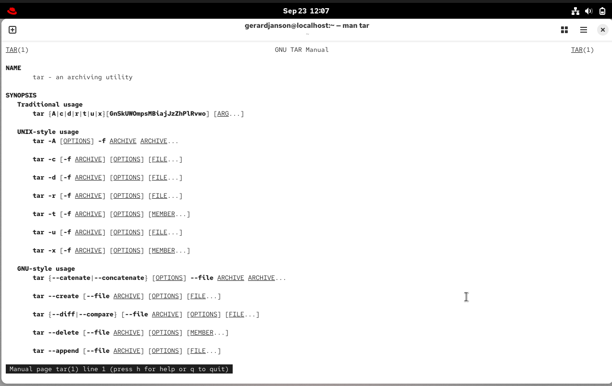
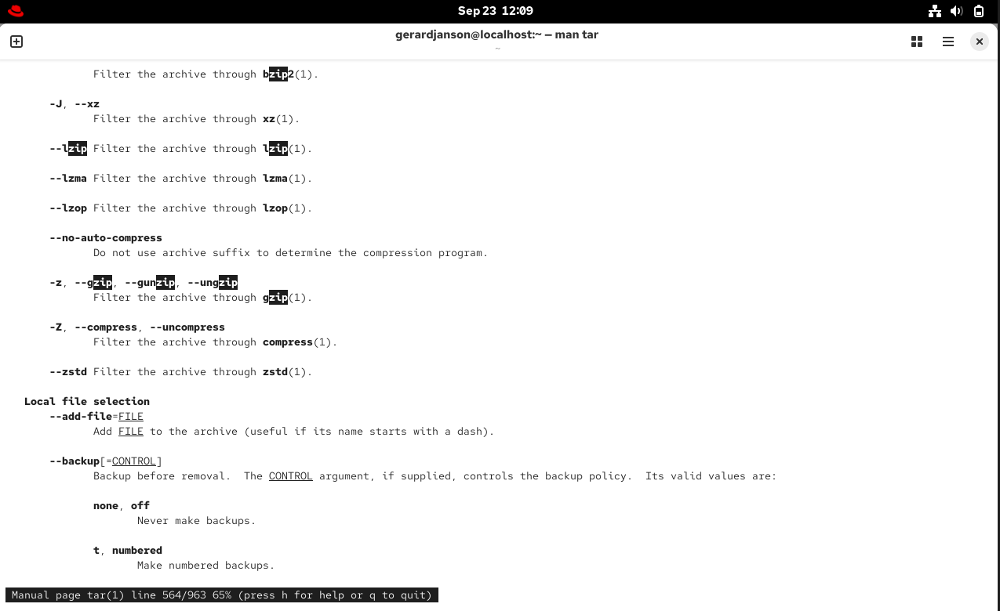
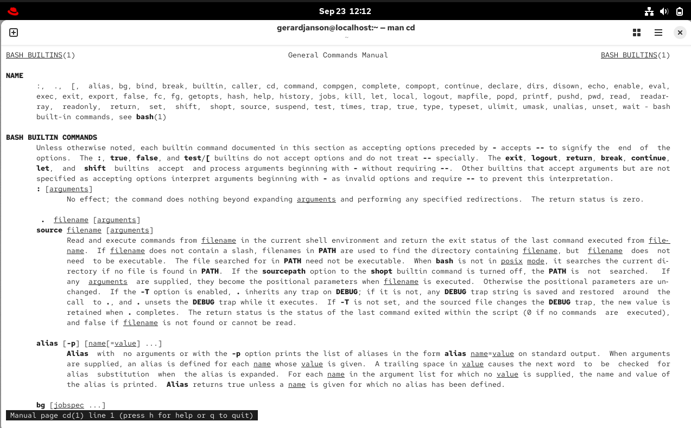

# 03. Documentation

_Video length: 2 min | Status: done_

## Goal

Practice using man pages to look up commands and config file formats, including searching within a page.

## Concepts involved

- Man pages — built-in manuals for commands and config files, no need to Google or memorize everything
- Man page sections — numbered by type, e.g. 1 = executable/shell commands, 5 = file formats & config files, 8 = system administration commands (usually root-only)
- Searching inside a man page with `/keyword`, jumping to next match with `n`, exiting with `q`

## Commands

```bash
$ man tar
```



```bash
$ man tar
/zip
n
q
```



```bash
$ man 5 crontab
```


```bash
$ man man
```

```bash
$ man cd
```


## Notes

When i stucked with a command i use man to learn more about it